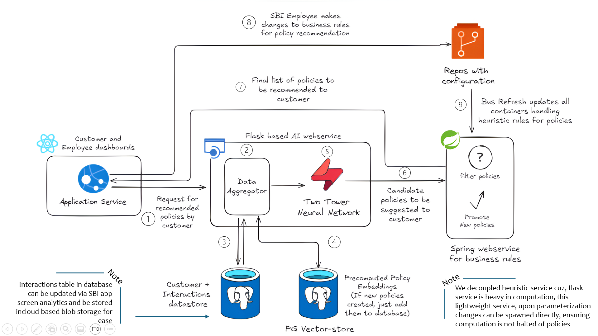
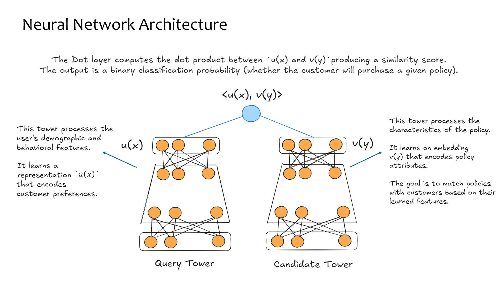

# SBI Hackathon Project

## Table of Contents
- [Introduction](#introduction)
- [System Architecture](#system-architecture)
- [Data Model](#data-model)
- [Candidate Policy Ranking](#candidate-policy-ranking)
- [Repository Structure](#repository-structure)
- [Setup Guide](#setup-guide)

## Introduction
**The aim of this project is to build a personalized insurance recommendation system for SBI Life that enhances customer engagement and policy sales. It achieves this by using a Two-Tower Neural Network, where one tower learns customer preferences from demographics and interactions, while the other encodes policy features. The system then matches customers with the most relevant policies through AI-driven similarity scoring, ensuring smarter, data-driven recommendations at scale.**

## System Architecture




## Data Model
The dataset consists of multiple structured tables (For POC, first three have been explored):

### 1️⃣ Customers Table (customers.csv)
Contains structured demographic and financial details of customers.
Below is the table with descriptions that clarify the type of data each field should model, using examples and ranges appropriate for an Indian context, particularly for SBI Life Insurance:

| Column Name                 | Data Type     | Description |
|-----------------------------|---------------|-------------|
| **customer_id**             | INT (PK)    | A unique, auto-generated integer identifier for each customer record. |
| **age**                     | INT          | Customer’s age in years. Should be a positive integer (e.g., typically between 18 and 100). |
| **gender**                  | VARCHAR(10)  | Customer’s gender. Use standardized values such as 'Male', 'Female', or 'Other'. |
| **income_bracket**          | VARCHAR(20)  | Income range of the customer expressed in numerical brackets based on current Indian income classifications. For example: '0-250000' (lower income), '250001-750000' (middle income), '750001-1500000' (upper middle income), etc. |
| **employment_status**       | VARCHAR(50)  | Customer’s primary source of income. Typical values include 'Salaried', 'Self-Employed', 'Retired', and may also include 'Student' or others as applicable. |
| **marital_status**          | VARCHAR(20)  | Marital status of the customer. Expected values include 'Single', 'Married', 'Divorced', or 'Widowed'. |
| **location_city**           | VARCHAR(100) | Name of the city where the customer resides. Use standardized Indian city names (e.g., 'Mumbai', 'Delhi', 'Bengaluru'). |
| **policy_ownership_count**  | INT          | The number of active insurance policies currently owned by the customer. Should be a non-negative integer. |
| **last_policy_purchase_date** | DATE       | The date when the customer last purchased an insurance policy, stored in the YYYY-MM-DD format for consistency and accurate tracking. |
| **credit_score**            | FLOAT        | Customer’s credit score indicating creditworthiness. Typically ranges from 300 to 900, in line with Indian credit scoring standards. |
| **preferred_policy_type**   | VARCHAR(50)  | The type of insurance policy the customer prefers. Use standardized names such as 'Term', 'Health', 'ULIP', etc. |


### 2️⃣ Policies Table (policies.csv)
Below is the revised table with enhanced descriptions that specify the type of data each field should model, using examples and terminology appropriate for the Indian insurance market, particularly for SBI Life Insurance:

| Column Name               | Data Type     | Description |
|---------------------------|---------------|-------------|
| **policy_id**             | INT (PK)    | A unique, auto-incremented identifier for each policy record. |
| **policy_name**           | VARCHAR(255) | The official name of the policy. This should match the naming used in marketing and official documents (e.g., "SBI Life Shield", "SBI Health Secure"). |
| **policy_type**           | VARCHAR(50)  | The category of the policy. Use standardized types such as 'Term', 'Whole Life', 'ULIP', 'Endowment', or 'Money Back', which reflect common classifications in the Indian market. |
| **sum_assured**           | FLOAT        | The total coverage amount offered by the policy, specified in Indian Rupees (INR). Values should be reflective of common Indian thresholds (e.g., 500000.00 for INR 5 Lakh, 10000000.00 for INR 1 Crore). |
| **premium_amount**        | FLOAT        | The premium payment required, specified in INR. Clarify the frequency (monthly, quarterly, or yearly) in supporting documentation, ensuring consistency with Indian pricing practices. |
| **policy_duration_years** | INT          | The term or duration of the policy in years. Typical values might be 10, 20, or 30 years, or represent a lifetime cover with a specific numeric convention as defined by the insurer. |
| **risk_category**         | VARCHAR(50)  | A classification that indicates the inherent risk associated with the policy. Use standardized terms such as 'Low', 'Medium', or 'High' to reflect underwriting risk and product volatility. |
| **customer_target_group** | VARCHAR(50)  | Specifies the primary demographic or market segment intended for the policy (e.g., "Young Professionals", "Retirees", "Families"). If multiple segments apply, use a comma-separated list. |
| **description**           | TEXT         | A detailed narrative of the policy, including benefits, exclusions, and key features. Ensure that the description is comprehensive and considers relevant regulatory and market specifics for India. |
| **keywords**              | TEXT         | A list of comma-separated keywords or tags extracted from the policy description. These keywords (e.g., "term, critical illness, investment, family") help in search optimization and categorization. |

This structure ensures that data is captured consistently and accurately, enabling better analysis and decision-making tailored to the Indian market.

### 3️⃣ User-Policy Interaction Table (interactions.csv)
Captures behavioral interactions between users and policies.

| Column Name          | Data Type  | Description |
|----------------------|-----------|-------------|
| interaction_id      | INT (PK)  | Unique ID for interaction |
| customer_id        | INT (FK)  | Customer ID |
| policy_id          | INT (FK)  | Policy ID |
| clicked           | BOOLEAN   | Whether the policy was clicked |
| viewed_duration   | FLOAT     | Time spent on policy page (seconds) |
| purchased        | BOOLEAN   | Whether the user bought this policy |
| comparison_count  | INT       | Number of times the policy was compared |
| abandoned_cart   | BOOLEAN   | If the policy was added to cart but not purchased |

### 4️⃣ Session Behavior Table (session_behavior.csv)
Tracks session-based behavioral insights for Google Analytics and ranking refinements.

| Column Name                  | Data Type     | Description |
|------------------------------|--------------|-------------|
| session_id                  | VARCHAR(50)  | Unique session ID |
| customer_id                 | INT (FK)     | Customer ID |
| search_keywords             | TEXT         | Keywords entered in search |
| policy_clicked_count        | INT          | Number of policies clicked in session |
| premium_adjusted            | BOOLEAN      | If the user changed coverage amounts |
| recommended_policy_clicked  | BOOLEAN      | Whether the user clicked a recommended policy |
| google_search_tracking     | BOOLEAN      | Whether external search data was available |

### 5️⃣ Policy Corpus Dataset (policy_corpus.csv)
For semantic search and embedding models, we store policy descriptions.

| Column Name       | Data Type     | Description |
|------------------|--------------|-------------|
| policy_id       | INT (PK)     | Reference to policies.csv |
| policy_name     | VARCHAR(255) | Name of the policy |
| description     | TEXT        | Full description of the policy |
| keywords       | TEXT        | Extracted keywords |
| embeddings     | VECTOR(768) | Policy embeddings (if using vector database) |


---
## Candidate Policy Ranking 

Once the **Two-Tower Neural Network** retrieves the top candidate policies for a given customer, the next step is to rank these policies effectively. Below are three different approaches to ranking:  

### 1️⃣ **Heuristics-Based Ranking**  

A simple and effective way to rank policies is by using predefined rules and scoring methods based on available customer and policy attributes.  

**Approach:**  
- Define a composite score using key attributes such as:  
  - **Similarity Score** → From the Two-Tower NN (if available).  
  - **Policy Popularity** → Number of times the policy was clicked/purchased.  
  - **Customer Fit** → Based on income bracket, preferred policy type, age group, and other demographic factors.  
  - **Recency Factor** → Policies purchased more recently by similar customers may be ranked higher.  
- Policies are sorted in descending order based on the composite score.  

**Advantages:**  
✅ Fast and computationally inexpensive.  
✅ Easily interpretable.  
✅ No need for additional training.  

**Limitations:**  
❌ Not adaptive—requires manual tuning.  
❌ Cannot generalize complex patterns as well as machine learning models.  

---

### 2️⃣ **Multi-Armed Bandits (MAB) for Adaptive Ranking**  

Multi-Armed Bandits (MAB) provide an **online learning approach** that balances **exploration (testing new policies)** and **exploitation (recommending policies that worked well in the past)**.  

**Steps:**  
1. Convert categorical data (e.g., **income_bracket**, **policy_type**, **employment_status**) into **numeric features** using encoding (e.g., one-hot encoding, label encoding).  
2. Initialize a bandit model (e.g., **Epsilon-Greedy, UCB, Thompson Sampling**) to estimate rewards for different policies.  
3. For a given customer, **select** a policy based on a balance of known rewards and exploration of new policies.  
4. **Update** the policy’s score based on customer interaction (e.g., clicks, purchases).  
5. Over time, the bandit algorithm learns to favor policies that lead to higher engagement.  

**Advantages:**  
✅ Learns in real time and dynamically adapts.  
✅ No need for offline training (works with continuous feedback).  
✅ Handles cold-start problems better than pre-trained models.  

**Limitations:**  
❌ Requires careful tuning of exploration-exploitation tradeoff.  
❌ Slower convergence compared to fully trained models (needs enough interactions to be effective).  

---

### 3️⃣ **XGBoost for Learning to Rank (LTR)**  

**XGBoost is a powerful gradient-boosting algorithm** that learns from past interactions to rank policies in a way that maximizes customer engagement.  

#### **Dataset Preparation**  
- **Training File:** `xgboost_train.csv` → Contains feature-rich interactions between customers and policies.  
- **Feature Engineering:**  
  - **Customer Features:** Age, income bracket, credit score, policy ownership count, etc.  
  - **Policy Features:** Policy type, sum assured, premium amount, duration, risk category, etc.  
  - **Two-Tower NN Similarity Score:** If available, this acts as a strong ranking feature.  
  - **Engagement Labels:** Clicks, viewed duration, purchase history (used as relevance scores).  

#### **Training Process**  
1. Train XGBoost with a **ranking objective** (e.g., `rank:ndcg` or `rank:pairwise`).  
2. Use `policy_corpus.csv` to **generate embeddings** for policies, which can be incorporated into the ranking model.  
3. Optimize hyperparameters and validate using metrics like **NDCG (Normalized Discounted Cumulative Gain)** or **MAP (Mean Average Precision)**.  
4. Deploy the trained model to rank the top candidate policies for each customer.  

**Advantages:**  
✅ Captures complex relationships between customer behavior and policy features.  
✅ High interpretability using feature importance.  
✅ Scalable for large datasets and improves over time.  

**Limitations:**  
❌ Requires labeled training data and periodic retraining.  
❌ Computationally more expensive than heuristics and MAB.  

---

## **Choosing the Right Ranking Approach**  

| Approach | Learning Method | Adaptability | Training Required | Computational Cost | Best Use Case |
|----------|----------------|--------------|--------------------|--------------------|---------------|
| **Heuristics** | Rule-based | Low | No | Low | Quick, static ranking |
| **Multi-Armed Bandits** | Online learning | High | No | Medium | Adaptive recommendations with real-time feedback |
| **XGBoost** | Supervised ML | High | Yes | High | Data-driven ranking for high accuracy |

Depending on your business needs and available data, you can:
- Start with **heuristics** for a baseline ranking approach.  
- Use **multi-armed bandits** if you want a real-time, self-adjusting ranking mechanism.  
- Train **XGBoost** if you have enough historical interaction data to build a high-performing ranking model.  

---

## Repository Structure

```
PolicyRecommendation/
│── candidate-generation-webservice/   # Flask-based backend for candidate generation
│   │── flask_app/                     # Flask application directory
│   │   │── __pycache__/                # Cached Python files
│   │   │── data/                        # Contains data-related files
│   │   │── model/                       # Model-related files
│   │   │── app.py                        # Main Flask application
│   │   │── config.py                     # Configuration file
│   │   │── requirements.txt              # Dependencies for backend
│   │── myvenv/                           # Virtual environment (optional)
│
│── datasets/                            # Contains dataset CSV files
│   │── customers.csv                     # Customer data
│   │── interactions.csv                   # Interaction data
│   │── policies.csv                       # Policy data
│   │── user_policy_interaction.csv        # User-policy interaction data
│
│── project/                              # Frontend project
│   │── src/                              # Source code
│   │   │── components/                    # UI components
│   │   │── data/                          # Data-related files
│   │   │── pages/                         # Page components
│   │   │── styles/                        # Styling files
│   │   │── App.tsx                        # Main React component
│   │   │── index.tsx                      # Entry point
│   │   │── main.tsx                       # Main file
│   │   │── vite-env.d.ts                   # TypeScript environment settings
│   │── index.html                         # Main HTML file
│   │── package.json                       # Node.js package configuration
│   │── package-lock.json                  # Lock file for dependencies
│   │── tailwind.config.js                  # Tailwind CSS configuration
│   │── tsconfig.json                      # TypeScript configuration
│   │── tsconfig.node.json                  # TypeScript node config
│   │── vite.config.ts                      # Vite configuration
│
│── readme-assets/                         # Assets for README documentation
│── .gitignore                             # Git ignore file
│── .hintrc                                # Linting configuration
│── candidate_generation.ipynb             # Jupyter Notebook for candidate generation
│── LICENSE                                # License file
│── README.md                              # Project documentation
```
---
## Setup Guide

1. **Clone the repository**
   ```bash
   git clone https://github.com/Aaditatgithub/Policy-Recommendations-with-Two-Tower-Architecture.git
   ```
2. **Navigate to the project directory**
   ```bash
   cd PolicyRecommendation
   ```
3. **Set up the backend**
   ```bash
   cd candidate-generation-webservice
   python -m venv myvenv  # Create virtual environment
   source myvenv/bin/activate  # Activate virtual environment (Windows: myvenv\Scripts\activate)
   pip install -r flask_app/requirements.txt  # Install backend dependencies
   ```
4. **Run the backend service**
   ```bash
   python flask_app/app.py
   ```
5. **Set up the frontend**
   ```bash
   cd ../project
   npm install  # Install frontend dependencies
   ```
6. **Run the frontend application**
   ```bash
   npm run dev
   ```

